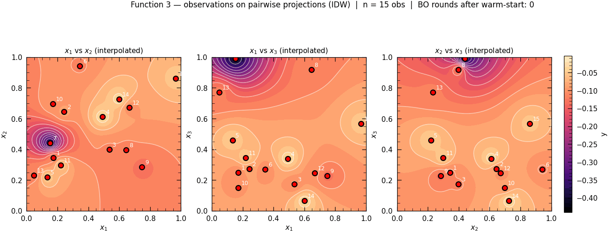
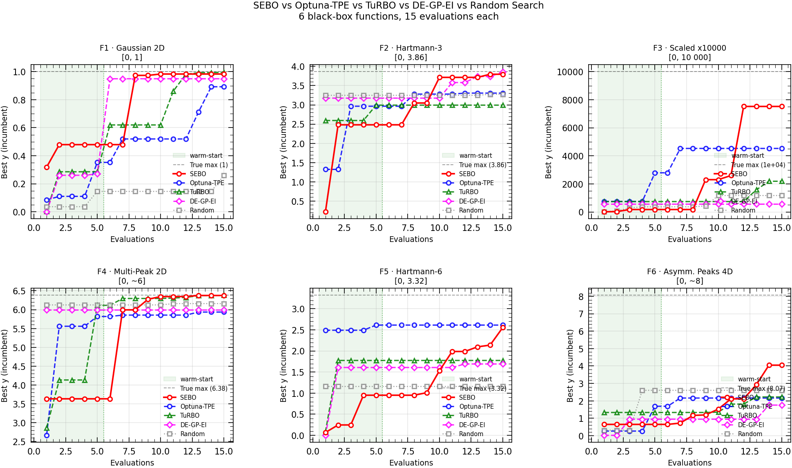

# SEBO — Sample-Efficient Bayesian Optimizer

**Author:** [Nikolas Karefyllidis, PhD](https://www.linkedin.com/in/karefyllidis/)


[](https://colab.research.google.com/github/karefyllidis/SEBO/blob/main/notebooks/demo_sklearn_hpo.ipynb)

---

I designed and implemented a GP-based sequential optimizer from scratch, applied it to the **[NeurIPS 2020 Black-Box Optimisation Challenge](https://neurips.cc/virtual/2020/protected/e_competitions.html)** format — 8 unknown objective functions (2D–8D), one evaluation per function per round, 13 rounds — and benchmarked it head-to-head against Optuna, TuRBO, and DE-GP-EI on identical observation histories. The core contribution is a full BO pipeline: automatic kernel selection by log-marginal likelihood, ensemble acquisition (EI + PI + UCB with centroid fallback), and output warping for skewed objectives. The same `suggest / observe` API generalises directly to **AutoML hyperparameter search**, drug discovery, and materials design — any setting where evaluations are expensive and every query counts.

---

## API

```python
from src.optimizers.optimizer import BayesianOptimizer

optimizer = BayesianOptimizer(
    bounds=[(0.0, 1.0)] * 4,   # search space — any dimension
    output_warping="log",        # for skewed objectives (log or boxcox)
    use_ensemble=True,           # EI + PI + UCB with centroid fallback
)
optimizer.fit(X_init, y_init)   # warm-start with existing observations

for _ in range(n_rounds):
    x_next = optimizer.suggest()          # GP surrogate + ensemble acquisition
    y_next = oracle(x_next)              # your expensive function here
    optimizer.observe(x_next, y_next)    # update the surrogate

print(optimizer.best)   # (best_x, best_y)
```

Drop-in for any black-box maximization problem: hyperparameter search, design of experiments, simulation optimization.

---

## The Problem

Eight unknown objective functions, dimensions 2–8, domain [0, 1]^d. No formula, no gradients. **One evaluation per function per round, across 13 rounds.** Maximise each within budget.

| # | Dim | Real-world analogy | Landscape character |
|---|-----|--------------------|---------------------|
| F1 | 2D | Radiation detection | Sparse signal; near-zero almost everywhere with a narrow high-value peak |
| F2 | 2D | Unknown ML model | Noisy; multiple local maxima |
| F3 | 3D | Drug discovery | Smooth, always negative; optimisation = least negative |
| F4 | 4D | Warehouse logistics | Many local optima, extreme outliers |
| F5 | 4D | Chemical process yield | Unimodal; output spans orders of magnitude near domain boundary |
| F6 | 5D | Recipe formulation | Noisy oracle; same input returned different y across rounds |
| F7 | 6D | Hyperparameter tuning | Sparse in 6D; smooth locally |
| F8 | 8D | High-dimensional ML model | Hardest; strong cumulative improvement with coverage |

Domain: **[0, 1]^d** for all functions. Higher y is always better; F3 and F6 outputs are negative.

---

## Results

**Best observed y after 13 rounds** (10 warm-start points per function):

| Function | Initial best y | Final best y | Improvement |
|----------|---------------|--------------|-------------|
| F1 | ~0.0 | 0.6704 | Large — narrow peak located in round 10 |
| F2 | ~0.19 | 0.7248 | Large |
| F3 | ~−0.44 | −0.0032 | Large (always negative; less negative = better) |
| F4 | ~0.04 | 0.2987 | Moderate |
| F5 | ~1700 | 7493.9 | Very large — near-boundary region [0.99, …] confirmed |
| F6 | ~−1.3 | −0.1402 | Large |
| F7 | ~0.003 | 2.7968 | Large |
| F8 | ~5.6 | 9.9619 | Large |

Full per-round strategy notes and GP diagnostics: [docs/model_card.md](docs/model_card.md#performance).

### GP Surrogate Evolution — Function 3 (Drug Discovery, 3D)



*Weekly evolution of pairwise IDW-interpolated projections of observed y. Red dots are evaluations numbered by round. Colour scale fixed across all frames for direct comparison. Regenerate with `python scripts/export_function3_gp_evolution_gif.py` once local `observations.csv` is present.*

---

## Why This Matters — Real-World Applications

The BO loop in SEBO is the same engine used by **Optuna, SMAC, and Ax** internally. Building it from scratch makes every design decision explicit and auditable.

- **AutoML / Hyperparameter Optimisation** — GP surrogate replaces grid/random search; finds better configs in fewer model-training calls. Demonstrated directly in the [HPO demo](notebooks/demo_sklearn_hpo.ipynb): SEBO tunes a RandomForest on Digits using 30 evaluations and consistently outperforms random search.
- **Drug Discovery & Materials Science** — sample-efficient search over molecular or material property spaces where each lab measurement is costly (F3 analogue: drug potency proxy).
- **Simulation Optimisation** — engineering or physics simulations where one run takes minutes to hours; BO is the standard approach for tuning parameters.
- **Neural Architecture Search** — treating layer widths, learning rates, and dropout as a continuous search space; same GP + acquisition loop applies.
- **Sequential Experiment Design** — A/B tests, clinical dose-finding, adaptive sampling — any setting where observations arrive one at a time and each one is expensive.

---

## Methodology

**Bayesian Optimisation** maintains a probabilistic surrogate (GP) over the unknown function and uses it to select the next query — balancing exploitation of known good regions against exploration of uncertain ones.

```
fit GP → maximise acquisition → evaluate f(x*) → append (x*, y*) → repeat
```

### Kernel Selection

At each round, three kernels compete for the best log-marginal likelihood (LML): **RBF**, **Matérn ν=1.5**, and **RBF + WhiteKernel**. The winner is selected automatically; hyperparameters are tuned by L-BFGS-B MLE with multiple restarts.

### Ensemble Acquisition

Three acquisition functions run simultaneously — EI, PI, and UCB. If their suggested next points are close together (agree), SEBO follows the EI recommendation. If they diverge (disagree), SEBO queries the centroid of all three — a soft blend that avoids over-committing to one strategy.

### Output Warping

For objectives spanning orders of magnitude (e.g. F5: values from ~1700 to ~7500), targets are log-transformed before GP fitting. The GP, acquisition functions, and incumbent tracking all operate in warped space; raw y values are stored and reported.

---

## Solver Benchmarks

Each notebook §6 compares SEBO against four open-source solvers on the **same observation history**:

| Solver | Method |
|--------|--------|
| **Optuna-TPE** | Tree-structured Parzen Estimator |
| **Optuna-GP** | Optuna's GP backend |
| **TuRBO** | Trust-Region Bayesian Optimisation |
| **DE-GP-EI** | Differential Evolution with GP-EI |

Run standalone:
```bash
pip install -r requirements-benchmark.txt
python append_results/run_optimizers_on_data.py --solvers my_bo optuna turbo de_gp_ei
```

---

## Demo — SEBO as an HPO Solver

[](https://colab.research.google.com/github/karefyllidis/SEBO/blob/main/notebooks/demo_sklearn_hpo.ipynb)

**[notebooks/demo_sklearn_hpo.ipynb](notebooks/demo_sklearn_hpo.ipynb)** — self-contained, no oracle data needed. Tunes a `RandomForestClassifier` on sklearn's Digits dataset (4D search space: n_estimators, max_depth, min_samples_split, max_features). 10 LHS warm-start + 20 BO iterations vs 30 random search evaluations.

**[notebooks/sebo_benchmark.ipynb](notebooks/sebo_benchmark.ipynb)** — SEBO (built from scratch) benchmarked against common open-source solvers — Optuna-TPE, TuRBO, DE-GP-EI, and Random Search — on 6 synthetic black-box functions spanning four orders of magnitude in output scale (log-warping on F3, asymmetric Gaussian peaks on F6). 15 evaluations per function.



*Incumbent best-y convergence across 15 evaluations per function. Green band = LHS warm-start. Dashed black line = true maximum.*

---

## Quick Start

```bash
pip install -r requirements.txt
python run_pipeline.py
```

Options:
- `--skip-notebooks` — print previously saved outputs without re-running notebooks
- `--skip-scripts` — skip `append_results/*.py` (use when observation history is already present)

> **Note on data:** Raw evaluation CSVs (`data/problems/`, `initial_data/`) are gitignored. The demo notebook and all pipeline logic run without them; GP evolution plots require local `observations.csv` files.

---

## Project Structure

```
sebo/
│
├── notebooks/
│   ├── function_{1..8}_*.ipynb         # One notebook per objective — full BO pipeline
│   └── demo_sklearn_hpo.ipynb          # Standalone HPO demo — start here
│
├── src/
│   ├── optimizers/
│   │   ├── optimizer.py                # BayesianOptimizer — stateful suggest/observe API
│   │   ├── my_bayesian/my_gp_skopt.py # GP + ensemble acquisition (EI/PI/UCB)
│   │   └── wrappers/                   # optuna, turbo, de_gp_ei, hyperopt solvers
│   └── utils/
│       ├── warping.py                  # log / Box-Cox output warping
│       ├── sampling_utils.py           # Sobol / LHS candidate generation
│       ├── plot_utilities.py           # Shared plot helpers
│       └── load_challenge_data.py      # Data loader
│
├── append_results/
│   ├── append_week{1..13}_results.py  # Round-append scripts (idempotent)
│   └── run_optimizers_on_data.py      # Benchmark all solvers
│
├── scripts/
│   └── export_function3_gp_evolution_gif.py
│
├── configs/                            # Solver configs (optuna, turbo, de_gp_ei, hyperopt)
├── docs/
│   ├── model_card.md                  # Architecture, per-round performance, limitations
│   ├── datasheet.md                   # Data provenance, composition, uses
│   └── TECHNICAL_FOUNDATIONS.md       # BO theory, kernel choices, key papers
│
├── run_pipeline.py
├── requirements.txt
└── requirements-benchmark.txt
```

---

## Documentation

| File | Contents |
|------|----------|
| [notebooks/demo_sklearn_hpo.ipynb](notebooks/demo_sklearn_hpo.ipynb) | **Start here** — self-contained HPO demo |
| [docs/model_card.md](docs/model_card.md) | Architecture, per-round performance, limitations |
| [docs/datasheet.md](docs/datasheet.md) | Data provenance, composition, collection, uses |
| [docs/TECHNICAL_FOUNDATIONS.md](docs/TECHNICAL_FOUNDATIONS.md) | BO theory, kernel selection, acquisition functions, references |

---

## Stack

**Python 3.10+** · NumPy · SciPy · scikit-learn (`GaussianProcessRegressor`) · scikit-optimize · Optuna · BoTorch/TuRBO · Matplotlib

---

## References

- Turner et al., PMLR Vol. 133 — [*Bayesian Optimization is Superior to Random Search for Machine Learning Hyperparameter Tuning: Analysis of the Black-Box Optimization Challenge 2020*](https://proceedings.mlr.press/v133/turner21a.html)
- [NeurIPS 2020 Black-Box Optimisation Challenge](https://neurips.cc/virtual/2020/protected/e_competitions.html)

---

## Licence

MIT. Initial warm-start data provided by Imperial College London for educational use; redistribution permitted for non-commercial, academic purposes.
