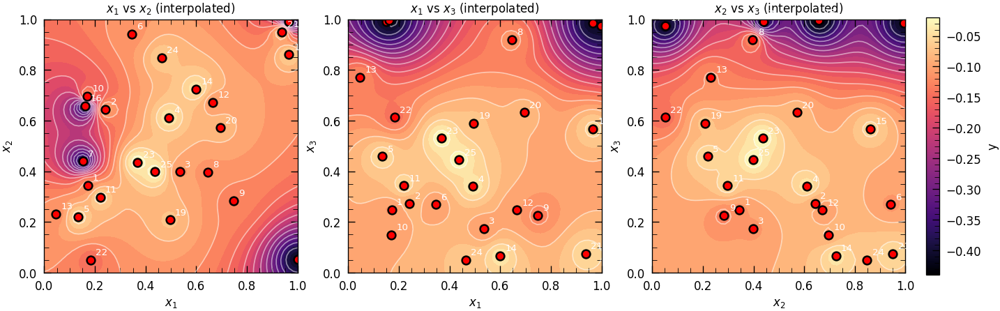

# Black-Box Optimisation with Bayesian Optimisation

**NeurIPS 2020 Black-Box Optimisation Competition — ICL PCMLAI Capstone**  
**Author:** [Nikolas Karefyllidis, PhD](https://www.linkedin.com/in/karefyllidis/)  
**Repository:** https://github.com/karefyllidis/black-box-optimization


---

## In Plain Language

Imagine trying to find the highest point on a landscape you cannot see — you can only poke the ground with a stick and measure how high you are. This project does that for eight hidden mathematical problems: one measurement per problem per week. Instead of guessing randomly, it uses **Bayesian Optimisation** — a method that learns from past measurements and picks the next most informative spot. Over 13 weeks, scores improved strongly on all eight tasks (for example, one chemical-process output rose from about 1,700 to about 7,500) without ever seeing the true formulas. The **public repository** holds code and write-ups; raw evaluation files stay **local only** (see [below](#data-on-disk-vs-public-github)).

---

## Challenge status

**The capstone challenge is complete.** No further portal submissions are planned. After **Week 13** feedback, the full `(x, y)` history for each function lives in `data/problems/function_N/observations.csv` **on your local checkout** — that path is **not** published on the public GitHub remote (see below). Re-running notebooks or `run_pipeline.py` is optional (analysis, plots, counterfactual solvers)—use `--skip-scripts` if you do not want append scripts to run again.

### Data on disk vs public GitHub

To respect hidden oracle data and course rules, **row-level evaluations are gitignored**: `initial_data/`, `data/problems/**`, and `data/submissions/**` (except placeholders such as `.gitkeep`). The **public repository** ships code, configs, append scripts, notebooks, and high-level documentation ([datasheet](docs/datasheet.md), [model card](docs/model_card.md)) with **summary** performance tables — not the raw CSV trails. To reproduce plots locally, merge your own `observations.csv` files from the capstone portal workflow (or your backed-up copies) into `data/problems/function_N/` beside a valid `initial_data/` tree from the course materials.

---

## At a Glance

| | |
|:---|:---|
| **Goal** | Sequential black-box **maximisation** on 8 unknown functions, NeurIPS 2020 BBO–style, **one new evaluation (x, y) per function per round** across the competition weeks. |
| **Method** | GP surrogates (LML across kernel families), ensemble or solo acquisition (EI / PI / UCB) on a **discrete** Sobol/LHS candidate set; in-notebook comparison with Optuna, TuRBO, DE-GP-EI. |
| **How to run** | `pip install -r requirements.txt` → `python run_pipeline.py` from the repo root (see [Quick Start](#quick-start)). |
| **Outcomes** | Best observed **y** per function and per-round strategy notes: **[Model Card — Performance](docs/model_card.md#performance)**. |
| **Stack** | **Python 3.10+** · NumPy, SciPy · scikit-learn `GaussianProcessRegressor` · scikit-optimize (acquisition) · Matplotlib; full pipeline re-executes notebooks with `nbconvert` + `ExecutePreprocessor`. |

**Evaluation budget** — Each round adds **one** evaluation per function; `data/problems/function_N/observations.csv` **accumulates** all past points on your machine. After the initial warm-start (10 points per function), a full local run through **Week 13** yields **23** points for 2D functions, up to **51** for F8 (see [datasheet — Composition](docs/datasheet.md#composition) for counts used in reporting).

**Project context** — ICL PCMLAI capstone (Module 21, individual project). **Relevant to:** black-box and simulation optimisation, AutoML / hyperparameter tuning, sequential experimental design.

---

## Overview

This project follows the format of the **[NeurIPS 2020 Black-Box Optimisation Challenge](https://neurips.cc/virtual/2020/protected/e_competitions.html)**: sequential optimisation of 8 unknown objective functions under a strict per-round evaluation budget, using the same suggest–observe API and Bayesmark evaluation framework as the competition.

**Bayesian Optimisation (BO)** was chosen as the core strategy because it is specifically designed for exactly this setting — expensive black-box objectives with no access to gradients or closed-form expressions, where every evaluation counts. BO builds a probabilistic surrogate (GP) over the unknown function and uses it to decide where to query next, trading off exploration of uncertain regions against exploitation of known good ones. This makes it far more sample-efficient than random search or grid search, which matters when only **one** new evaluation per function is allowed per round.

The pipeline features automatic kernel selection via log-marginal likelihood (RBF, Matérn, RBF+WhiteKernel), MLE-based kernel hyperparameter optimisation, and an ensemble acquisition strategy (EI + PI + UCB) that switches between exploitation and exploration based on **maximum pairwise** distance between the three acquisition argmaxes (see [Model card — Model description](docs/model_card.md#model-description)).

**Documentation:** **[Datasheet](docs/datasheet.md)** · **[Model Card](docs/model_card.md)** · **[Technical Foundations](docs/TECHNICAL_FOUNDATIONS.md)** · **[Documentation Index](docs/README.md)**

---

## The 8 Functions

| # | Dim | Analogy | Description |
|---|-----|---------|-------------|
| 1 | 2D | Radiation detection | Sparse signal; output is near-zero across most of the domain with a narrow high-value region. |
| 2 | 2D | Mystery ML model | Noisy surface with multiple local peaks; requires careful balance of exploration and exploitation. |
| 3 | 3D | Drug discovery | Smooth but always-negative output; optimisation is finding the least-negative value. |
| 4 | 4D | Warehouse logistics | Many local optima and occasional extreme outliers; highly non-convex landscape. |
| 5 | 4D | Chemical process yield | Unimodal; output spans several orders of magnitude, concentrated near domain boundaries. |
| 6 | 5D | Recipe optimisation | Negative outputs throughout; mild oracle noise observed (same input returned different y across rounds). |
| 7 | 6D | Hyperparameter tuning | Simulates tuning a model (learning rate, regularisation, layers); smooth but sparse in 6D. |
| 8 | 8D | High-dimensional ML model | Highest-dimensional function; strong improvement with high cumulative coverage. |

Domain: **[0, 1]^d** for all functions. Higher y is always better; F3 and F6 outputs are negative (e.g. −0.02 > −0.44).

### Example: GP Surrogate — Function 3 (Drug Discovery, 3D)



*Pairwise IDW-interpolated projections of the GP surrogate after 25 observations. Red dots are evaluated query points (numbered by round). The warm (light) regions indicate higher predicted y; the surrogate identifies a promising cluster near x₁ ≈ 0.15–0.20 in the x₁–x₂ plane.*

---

## Background: Bayesian Optimisation

**Bayesian optimisation (BO)** is a sample-efficient, sequential strategy for expensive black-box objectives. There is no formula for f(x) — only point evaluations. BO maintains a **Gaussian Process (GP) surrogate** that provides:

- **μ(x)** — predictive mean (exploitation signal)
- **σ(x)** — predictive uncertainty (exploration signal)

An **acquisition function** (EI, UCB, PI) combines these to select the next query. The loop is:

```
fit GP → maximise acquisition → evaluate f(x*) → append (x*, y*) → repeat
```

GPs are data-efficient and naturally quantify uncertainty, making them well-suited to low-budget, moderate-dimensional problems (d = 2–8 here). Three kernels are compared at each round — **RBF**, **Matérn (ν=1.5)**, and **RBF+WhiteKernel** — with the best selected automatically by log-marginal likelihood (LML).

---

## Pipeline

Each notebook follows a fixed 8-section structure:

1. **Setup** — imports, load observations from `data/problems/function_N/observations.csv`
2. **Parameters** — `OPTIMIZE_KERNEL`, kernel / warping, acquisition coefficients (ξ, κ), `CANDIDATE_SAMPLING_METHOD`, `USE_ENSEMBLE` (or `SOLO_STRATEGY`), `NEXT_QUERY_SOLUTION`
3. **Visualise** — GP surrogate surfaces; 2D contour (d=2), pairwise projections (d≥3)
4. **Acquisition** — EI/PI/UCB over a Sobol/LHS candidate set; LML kernel selection; duplicate masking
5. **Select query** — EI argmax, or centroid of the three argmaxes when max pairwise L2 **exceeds** `AGREE_THRESHOLD`; proximity guard
6. **MyBO vs open source** — compare with Optuna-TPE, Optuna-GP, TuRBO, DE-GP-EI
7. **Append feedback** — after portal returns (x, y), set `IF_APPEND_DATA = True`
8. **Save submission** — write chosen vector to `data/submissions/function_N/`

### Technical Capabilities of the Workflow

The implementation separates four concerns you can tune independently in the **Parameters** cell. Together they define *how* the GP is fit, *where* the next Bayesian optimisation (BO) point is searched, *how* acquisition functions are combined, and *which* solver's point is **submitted** to the portal versus shown only for **benchmarking** next to open-source baselines.

| Capability | What it governs | Why it matters |
|------------|------------------|----------------|
| **`OPTIMIZE_KERNEL`** | After LML kernel **family** selection, whether lengthscales and signal variance are **MLE-tuned** (L-BFGS-B, with restarts) or **fixed**. | MLE usually adapts the surrogate to the data; turning it off can stabilise very small or very noisy runs where kernel optimisation chases noise. |
| **`CANDIDATE_SAMPLING_METHOD`** | How the **discrete** set of points in \([0,1]^d\) is built before taking an **argmax of the acquisition** (Sobol, LHS, and in some notebooks grid or i.i.d. random). | This is the geometry of the "inner loop" for the next query: the BO proposal is the best **candidate**, not a continuous global optimiser of the acquisition. |
| **`USE_ENSEMBLE` + `SOLO_STRATEGY`** | **Ensemble:** run EI, PI, and UCB; if **max pairwise** L2 among the three argmaxes is **≤ `AGREE_THRESHOLD`**, use the EI point; if it **exceeds** the threshold, use the **centroid** of the three argmaxes (same rule as the [model card](docs/model_card.md#model-description)). **Solo:** a single policy from `SOLO_STRATEGY` (`"EI"`, `"PI"`, or `"UCB"`). | The ensemble softens over-commitment to one acquisition; solo mode is simpler and easy to ablate. |
| **`NEXT_QUERY_SOLUTION`** | Which key in the notebook's `_solutions` dict (MyBO, Optuna, TuRBO, …) is **written** to `next_input.npy` and the portal string. | You can run every solver in one notebook and **switch the submission** without re-running the rest; invalid names **fall back** to `MyBO`. |

**Elaboration**

- **`OPTIMIZE_KERNEL`** — With `True`, the chosen kernel (after per-family LML comparison) is **re-fit** with hyperparameter optimisation, so the GP's smoothness and noise scale track the current observations. With `False`, the optimiser is disabled for kernel parameters (`optimizer=None`, zero restarts), which is faster and can be preferable on specific functions (see per-notebook defaults).

- **`CANDIDATE_SAMPLING_METHOD`** — Acquisition values are only computed on this finite set; the "next x" is its **constrained** maximiser. Sobol and LHS give space-filling designs with different low-discrepancy properties; the choice affects where the argmax is allowed to sit between rounds.

- **`USE_ENSEMBLE`** — If the **largest** pairwise L2 among the EI, PI, and UCB argmaxes is at most `AGREE_THRESHOLD`, the next query is the **EI** maximiser; otherwise the **centroid** of the three argmaxes (see [model card](docs/model_card.md#model-description)). If `USE_ENSEMBLE=False`, only `SOLO_STRATEGY` is used, matching a classic single-acquisition BO loop.

- **`NEXT_QUERY_SOLUTION`** — The notebook typically computes one `next_x` per method (MyBO, Optuna-TPE, etc.); this flag only selects which vector enters **weekly submission** files. The others remain in the notebook for **fair comparison** on the same observation history.

**Full flag reference** (cell 2 of each notebook; includes warping, masking, and kernel forcing):

| Flag | Default | Effect |
|------|---------|--------|
| `OPTIMIZE_KERNEL` | notebook-dependent | `True`: MLE for kernel params (L-BFGS-B, `N_RESTARTS_KERNEL` restarts). `False`: fixed kernel params, `optimizer=None`. |
| `CANDIDATE_SAMPLING_METHOD` | e.g. `"sobol"`, `"lhs"` | Candidate pool for **acquisition argmax**; often `"sobol"` or `"lhs"`; F1 also `"grid"` / `"random"`. |
| `USE_ENSEMBLE` | `True` | `True`: EI+PI+UCB; max pairwise L2 ≤ `AGREE_THRESHOLD` → EI argmax, else → centroid. `False`: `SOLO_STRATEGY` only. |
| `SOLO_STRATEGY` | e.g. `"UCB"` | Used only if `USE_ENSEMBLE=False`: `"EI"`, `"PI"`, or `"UCB"`. |
| `NEXT_QUERY_SOLUTION` | `'MyBO'` | Key in `_solutions` to export; unknown key → `MyBO`. |
| `GP_KERNEL` | `None` (LML auto) | Force kernel: `'RBF'`, `'Matern'`, `'RBF + WhiteKernel'`. |
| `OUTPUT_WARPING` | `None` | `'log'` (e.g. F1/F5/F7); optional `'boxcox'`. |
| `MIN_DIST_THRESHOLD` | `0.05` | Drop candidates too close to past observations (L2). |
| `BOUNDARY_MARGIN` | `0.05` (d≤3), `0` (d≥4) | Optional mask near domain boundaries. |
| `XI_EI_PI` | per notebook | skopt **ξ** for EI/PI (`gaussian_ei` / `gaussian_pi`). **Lower** values skew toward **exploitation** (tighter refinement around the incumbent). |
| `KAPPA_UCB` | per notebook | skopt **κ** for lower confidence bound / UCB (`gaussian_lcb`). **Lower** κ puts **less** weight on predictive uncertainty (again exploit-leaning). |
| `AGREE_THRESHOLD` | per notebook | Ensemble only: if the **maximum** pairwise L2 among the EI, PI, and UCB argmaxes is **strictly below** this value → use the **EI** point; **otherwise** → **centroid** of the three. **Higher** threshold ⇒ “agree” more often ⇒ EI more often vs centroid (exploit-leaning for late rounds). |

**Round 10 / final submission settings (kept for subsequent rounds unless changed in notebook Parameters cells):**

| Function | `XI_EI_PI` | `KAPPA_UCB` | `AGREE_THRESHOLD` |
|----------|------------|-------------|---------------------|
| F1, F2 | 0.02 | 0.75 | 0.22 |
| F3 | 0.005 | 0.75 | 0.12 |
| F4 | 0.02 | 1.0 | 0.22 |
| F5 | 0.005 | 0.01 | 0.22 |
| F6 | 0.005 | 1.0 | 0.22 |
| F7 | 0.005 | 0.6 | 0.22 |
| F8 | 0.005 | 0.8 | 0.22 |

F5 keeps an unusually small κ because UCB is used with **log**-warped `y`; large κ otherwise drives UCB toward high-σ regions in warped space. F3 uses a lower `AGREE_THRESHOLD` than the others historically; for the final run it was **raised** from 0.05 to **0.12** so EI is preferred more often relative to the centroid.

---

## Quick Start

```bash
pip install -r requirements.txt
```

**Run the full pipeline** (by default: run append scripts, then notebooks, then benchmark script—see `run_pipeline.py`):
```bash
python run_pipeline.py
```

Options:
- `--skip-notebooks` — print previously saved portal strings without re-running notebooks
- `--skip-scripts` — skip `append_results/*.py` (recommended for **post-challenge** replays so Week 1–13 appends are not re-applied)

**Benchmark solvers** against the accumulated observations:
```bash
pip install -r requirements-benchmark.txt
python append_results/run_optimizers_on_data.py --solvers my_bo optuna turbo de_gp_ei
```

**Append scripts (historical).** During the challenge, each `append_results/append_weekN_results.py` recorded portal (x, y) into `observations.csv`. With the challenge **finished**, you normally **do not** run these again unless you are repairing or replaying history from scratch. Final state is already merged through Week 13.

### Reproducibility and Validation

- **Data state** — `run_pipeline.py` runs `append_results/*.py` (unless `--skip-scripts`), then executes all eight notebooks. Outputs depend on the current `observations.csv` files; re-running after appending a round changes the "next query" and plots.
- **Randomness** — Notebooks set seeds where they sample candidates and related draws; L-BFGS-B MLE in scikit-learn and floating-point order can still yield **small run-to-run differences** on the same data.
- **Execution** — Each notebook is capped at a **5-minute** execute timeout in the pipeline; a full `run_pipeline.py` may take on the order of **several minutes to tens of minutes** depending on hardware.
- **Tests** — There is **no** automated `pytest` suite; correctness is checked by **running** `run_pipeline.py` and inspecting submissions under `data/submissions/`. Add CI if you fork this for production use.

---

## Project Structure

```
black-box-optimization/
│
├── initial_data/                      # Read-only warm-start data (DO NOT MODIFY)
│   └── function_{1..8}/               # initial_inputs.npy, initial_outputs.npy
│
├── data/
│   ├── problems/function_{1..8}/      # observations.csv — all (x, y) pairs appended each round
│   ├── submissions/function_{1..8}/   # next_input.npy, next_input_portal.txt
│   └── results/                       # Exported plots (when IF_EXPORT_PLOT = True)
│
├── notebooks/
│   ├── function_1_Radiation-Detection.ipynb
│   ├── function_2_Mystery-ML-Model.ipynb
│   ├── function_3_Drug-Discovery.ipynb
│   ├── function_4_Warehouse-Logistics.ipynb
│   ├── function_5_Chemical-Process-Yield.ipynb
│   ├── function_6_Recipe-Optimization.ipynb
│   ├── function_7_Hyperparameter-Tuning.ipynb
│   └── function_8_High-dimensional-ML-Model.ipynb
│
├── src/
│   ├── optimizers/
│   │   ├── my_bayesian/my_gp_skopt.py          # GP+skopt BO (EI/PI/UCB/Thompson/Entropy Search)
│   │   └── wrappers/                            # optuna_solver, turbo_solver, de_gp_ei_solver, hyperopt_solver
│   └── utils/
│       ├── load_challenge_data.py               # load_function_data(N); read-only guard
│       ├── warping.py                            # apply_output_warping / inverse (log, boxcox)
│       ├── plot_utilities.py                     # Shared plot styling and export helpers
│       └── sampling_utils.py                     # sample_candidates() wrapper
│
├── append_results/
│   ├── append_week{1..13}_results.py            # Append portal (x, y) to observations.csv (one file per round)
│   └── run_optimizers_on_data.py                # Benchmark solvers on accumulated data
│
├── configs/
│   ├── optuna_optimizer.yaml
│   ├── turbo_optimizer.yaml
│   ├── de_gp_ei_optimizer.yaml
│   └── hyperopt_optimizer.yaml
│
├── docs/
│   ├── README.md                                # Documentation index
│   ├── datasheet.md                             # Dataset documentation (composition, collection, uses)
│   ├── model_card.md                            # Model documentation (architecture, performance, limitations)
│   ├── TECHNICAL_FOUNDATIONS.md                 # Key papers, library choices, BO theory
│   ├── project_roadmap.md                       # Notebook workflow, planned components, future work
│   ├── Capstone_Project_FAQs.md                 # Portal submission format, data loading, allowed methods
│   ├── BBO_capstone_presentation_23.2_Nikolas_Karefyllidis.md  # Pointer to capstone presentation
│   └── BBO_capstone_presentation_23.2_Nikolas_Karefyllidis.txt # Capstone Module 23.2 plain-text answers
│
├── run_pipeline.py
├── requirements.txt
├── requirements-benchmark.txt
└── README.md
```

**Note:** `docs_private/` holds private notes and drafts ([`docs_private/README_PRIVATE.md`](docs_private/README_PRIVATE.md)). Not required for running the pipeline; most of it never appears on the public remote.

---

## Documentation Index

| File | Contents |
|------|----------|
| [docs/datasheet.md](docs/datasheet.md) | Dataset datasheet — motivation, composition, collection, preprocessing, uses, licence |
| [docs/model_card.md](docs/model_card.md) | Model card — architecture, latest performance summary, assumptions, limitations, ethical considerations |
| [docs/TECHNICAL_FOUNDATIONS.md](docs/TECHNICAL_FOUNDATIONS.md) | BO theory, kernel choices, acquisition functions, key papers |
| [docs/project_roadmap.md](docs/project_roadmap.md) | Notebook workflow, `run_pipeline.py` usage, future work |
| [docs/Capstone_Project_FAQs.md](docs/Capstone_Project_FAQs.md) | Portal submission format, data loading, allowed methods |
| [docs/BBO_capstone_presentation_23.2_Nikolas_Karefyllidis.txt](docs/BBO_capstone_presentation_23.2_Nikolas_Karefyllidis.txt) | Capstone Module 23.2 presentation (plain text, sections 1–5) |

---

## Results and Performance

**Best observed y after Week 13 append** (see [Model Card — Performance](docs/model_card.md#performance) for full details):

| Function | Initial best y (10 pts) | Best y in current dataset | Improvement | Notes |
|----------|------------------------|----------------------|-------------|-------|
| F1 | ~0.0 | 0.6704 | Large | Narrow high region found in round 10 |
| F2 | ~0.19 | 0.7248 | Large | Best at x₁ ≈ 0.70 |
| F3 | ~−0.44 | −0.0032 | Large | Output is always negative; improvement = less negative |
| F4 | ~0.04 | 0.2987 | Moderate | High variance; many local optima |
| F5 | ~1700 | 7493.9 | Very large | Near-boundary region [0.99, 0.99, …] |
| F6 | ~−1.3 | −0.1402 | Large | Noisy oracle behavior; duplicates at same x showed y variability |
| F7 | ~0.003 | 2.7968 | Large | Steady improvement via UCB exploration |
| F8 | ~5.6 | 9.9619 | Large | Consistent upward trend across all rounds |

**No claim of global optimality** — The oracle functions are unknown; these are the best values observed within the evaluation budget. Performance is relative and assessed via cumulative-best plots and GP diagnostics in each notebook.

---

## For Markers and Reviewers

### How to Re-run

1. **Install dependencies:** `pip install -r requirements.txt` (Python 3.10+)
2. **Run the pipeline:** `python run_pipeline.py` from the repository root
3. **Inspect outputs:** 
   - Portal submission strings printed to console
   - Submission files: `data/submissions/function_N/next_input_portal.txt`
   - Executed notebooks: `notebooks/function_N_*.ipynb` (with outputs)

### What is Gitignored

- `initial_data/` — **ignored** (course warm-start; keep local, do not modify)
- `data/problems/**` — **ignored** (oracle `(x, y)` trails — **not** on public GitHub)
- `data/submissions/**` — **ignored** (portal vectors — **not** on public GitHub)
- `data/results/` — **ignored** (regenerated plots)
- `*.csv` — **ignored** globally (extra guard against accidental commits)
- `docs_private/*` — **ignored** except `README_PRIVATE.md`, `unused_or_removable_inventory.md`, and `20_notebooks_for_devel/`
- `.DS_Store`, `__pycache__/`, `.ipynb_checkpoints/` — **ignored**

See `.gitignore` for the authoritative list.

### Append Scripts (historical)

During the challenge, after each round's portal feedback, the matching `append_results/append_weekN_results.py` appended the new (x, y) pairs to `observations.csv`. These scripts are **idempotent** and remain in the repo for **replay or repair** only.

Example workflow (as used mid-challenge, **private clone only** — do not commit `observations.csv` to a public remote):
```bash
python append_results/append_week5_results.py   # illustrative
python run_pipeline.py --skip-scripts           # post-challenge: avoid re-running all appends
# Keep observations.csv local; verify `git status` does not list data/problems/ before pushing
```

---

## Academic Integrity and Evaluation Budget

**Challenge concluded.** All official evaluations for this capstone are complete; your **local** tree can hold the full portal trail through Week 13. The public GitHub mirror intentionally omits row-level oracle files.

**Evaluation budget:** While the challenge ran, each round permitted **one** new evaluation per function. The `append_weekN_results.py` scripts record exactly what was submitted and what the portal returned. No additional queries were made outside the official submission process.

**No claim of global optimality:** The oracle functions are unknown and the evaluation budget is limited. The reported "best y" values are the best **observed** within the budget, not proven global optima. Performance is assessed relative to the initial warm-start data and compared against open-source baselines (Optuna, TuRBO, DE-GP-EI) on the same observation history.

**Reproducibility:** With the **same** local `observations.csv` files and seeds, the pipeline can be re-run deterministically (modulo small floating-point differences in L-BFGS-B). Those files are your responsibility to retain privately; they are not part of the public repository snapshot.

---

## References

- [NeurIPS 2020 — Competitions (virtual)](https://neurips.cc/virtual/2020/protected/e_competitions.html)
- **Post-challenge report (organisers):** Turner et al., PMLR Vol. 133 — [*Bayesian Optimization is Superior to Random Search for Machine Learning Hyperparameter Tuning: Analysis of the Black-Box Optimization Challenge 2020*](https://proceedings.mlr.press/v133/turner21a.html) — official competition analysis and write-up in the NeurIPS 2020 Competition Volume.

---

## Licence

MIT Licence. See repository for details. Initial warm-start data provided by Imperial College London for educational use; redistribution permitted for non-commercial, academic purposes.
